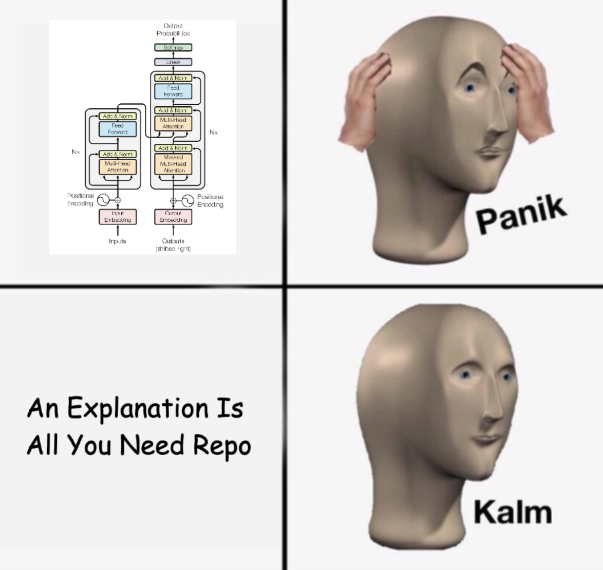

# An Explanation Is All You Need: The Transformer Decoded

  

Welcome to my repo! I implement the transformer architecture from scratch using PyTorch. I tried to go through all the key subcomponents, adding extensive notes and clarifications. This repository's key objective is to provide knowledge and precise explanations for each component.

## 🔥 Overview
You will go through all the components explained in the [original paper](https://arxiv.org/abs/1706.03762). Apart from building the architecture, the notes provide insights to understand the rationale behind all the blocks of this architecture. I also tried to define parameters and variables that I found confusing when studying them (e.g., d_v vs d_k).

## 👨🏽‍💻 What will I learn?
These are the blocks that you will learn to build with this repository. All of these were built from scratch, which will provide you with a good understanding of what's under the hood.
- Input Embeddings
- Positional Embeddings
- Layer Normalization
- Point-Wise Feed-Forward Network
- Multi-Head Attention
- Residual Connections
- Encoder Block
- Decoder Block
- Ensemble the Transformer

## 🤔 Why should I look at this and reproduce it?
The transformer architecture is the SOTA architecture behind the most relevant advancements in AI. It is key to understand what is going on in the original implementation of this beast. It is also a good skill to have if you are looking to go down the research path; you need to understand the origins to be able to know what to improve!

## 👀 Do I need to know how to use PyTorch?
The answer to this question is yes. Let me explain. 

I would be lying if I told you you are fine without background on the PyTorch workflow. You need to know the basics, such as how to initialize a nn.Module objects, play with tensors or understand why transformations need to be applied. Apart from that, you will also need basic deep-learning/machine-learning knowledge (e.g., what is a linear layer? What are dimensions? What is an embedding?).
